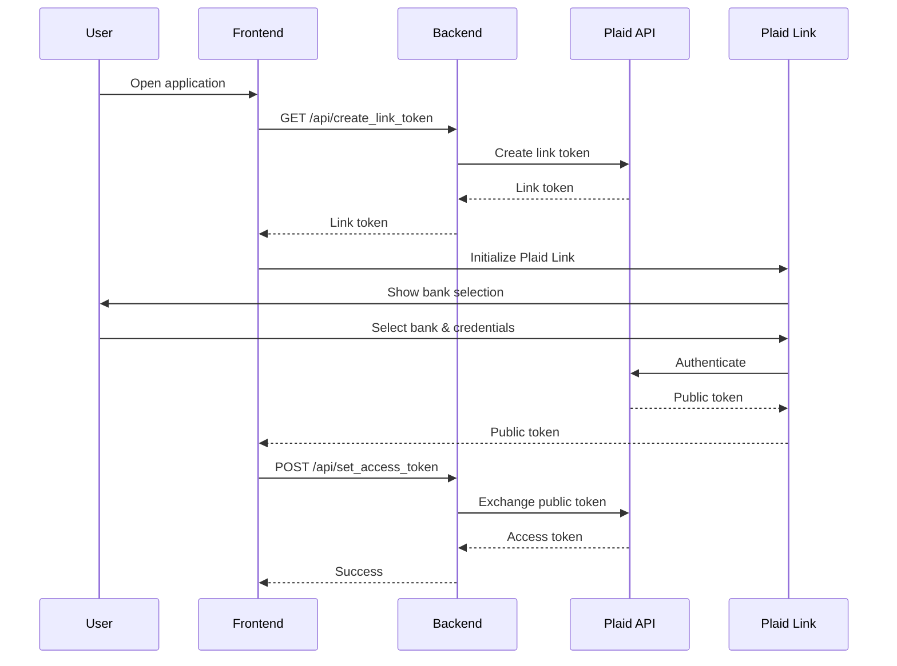
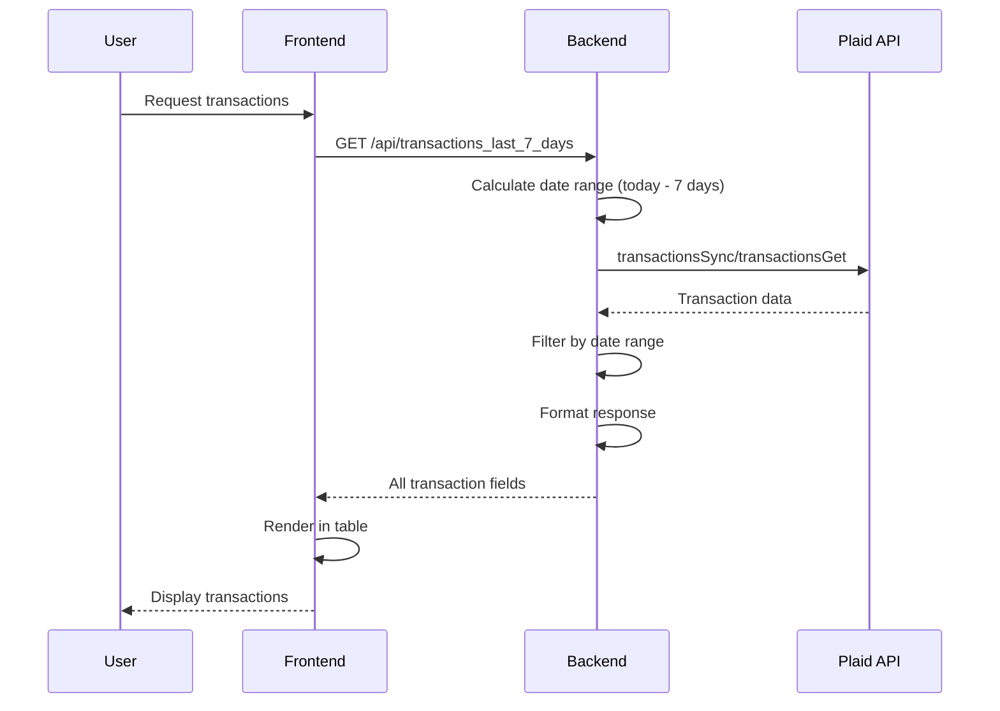

# Architecture Documentation - Plaid-Bank-Transfer

**Author:** Giuseppe Bosi

## System Architecture

### High-Level Overview

```
┌─────────────┐         ┌──────────────┐         ┌─────────────┐
│   Browser   │◄───────►│   Frontend   │◄───────►│   Backend   │
│  (Client)   │  HTTP   │   (React)    │  REST   │  (Express)  │
└─────────────┘         └──────────────┘         └──────┬──────┘
                                                        │
                                                        │ HTTPS
                                                        ▼
                                                 ┌─────────────┐
                                                 │ Plaid API   │
                                                 │  (External)  │
                                                 └─────────────┘
```

## Ports (project standard)

| Service  | Port | URL                   |
|----------|------|-----------------------|
| Frontend | 4000 | http://localhost:4000 |
| Backend  | 4001 | http://localhost:4001 |

## Component Details

### Frontend (React)

**Location:** `frontend/src/`

**Components:**
- `App.jsx`: Main application component
  - Manages Plaid Link initialization
  - Handles authentication flow
  - Coordinates transaction fetching
  - Error handling and loading states

- `TransactionsTable.jsx`: Transaction display component
  - Renders all transaction fields in a table
  - Formats dates and amounts
  - Responsive design
  - Field visibility toggle (optional)

**Technologies:**
- React 18+
- Plaid Link (for bank authentication)
- Fetch API or Axios (for backend communication)

### Backend (Node.js/Express)

**Location:** `backend/`

**Main File:** `server.js`

**Endpoints:**

1. **POST `/api/create_link_token`**
   - Creates a Plaid Link token for frontend initialization
   - Returns token to client
   - No authentication required

2. **POST `/api/set_access_token`**
   - Exchanges Plaid public token for access token
   - Stores access token (in-memory for now)
   - Returns success status

3. **GET `/api/transactions_last_7_days`**
   - Retrieves transactions from last 7 days
   - Uses Plaid `transactionsSync` or `transactionsGet` API
   - Filters by date range
   - Returns all available transaction fields

**Technologies:**
- Node.js
- Express.js
- Plaid SDK (`plaid` package)
- dotenv (environment variables)
- CORS middleware

## Data Flow

### Authentication Flow



### Transaction Retrieval Flow



## Transaction Data Structure

### Plaid Transaction Object

The application displays all available fields from Plaid transaction objects:

**Core Fields:**
- `transaction_id`: Unique identifier
- `account_id`: Associated account ID
- `date`: Transaction date (YYYY-MM-DD)
- `name`: Transaction name/description
- `merchant_name`: Merchant name (if available)
- `amount`: Transaction amount (positive for debits, negative for credits)
- `iso_currency_code`: Currency code (e.g., "USD")
- `unofficial_currency_code`: Unofficial currency (if applicable)

**Categorization:**
- `category`: Transaction category array
- `personal_finance_category`: Detailed finance category
- `payment_channel`: Payment method (online, in store, etc.)

**Status:**
- `pending`: Whether transaction is pending
- `authorized_date`: Date transaction was authorized
- `authorized_datetime`: Full datetime of authorization
- `datetime`: Transaction datetime

**Location:**
- `location`: Geographic location data
  - `address`: Street address
  - `city`: City name
  - `region`: State/region
  - `postal_code`: ZIP code
  - `country`: Country code
  - `lat`: Latitude
  - `lon`: Longitude

**Additional:**
- `transaction_code`: Transaction type code
- `account_owner`: Account owner information
- `merchant_entity_id`: Merchant entity identifier

## Security Considerations

### Current Implementation
- Access tokens stored in-memory (development only)
- Environment variables for sensitive data
- CORS configured for localhost development

### Production Recommendations
- Store access tokens in secure database
- Implement user authentication
- Use HTTPS in production
- Implement token refresh logic
- Add rate limiting
- Implement proper error handling and logging

## API Integration

### Plaid API Usage

**Products Used:**
- `transactions`: Read transaction data

**Endpoints Used:**
- `/link/token/create`: Create Link token
- `/item/public_token/exchange`: Exchange public token
- `/transactions/sync`: Sync transactions (recommended)
- `/transactions/get`: Get transactions by date range (alternative)

**Environment:**
- Sandbox: For development and testing
- Production: For live bank connections (requires approval)

## Error Handling

### Backend Error Handling
- Plaid API errors are caught and formatted
- HTTP status codes returned appropriately
- Error messages logged for debugging

### Frontend Error Handling
- Network errors displayed to user
- Plaid Link errors handled gracefully
- Loading states during API calls
- User-friendly error messages

## Future Enhancements

### Step 2: Order Matching
- Parse transaction notes for order codes
- Match format: `idcliente_AAAAMMGG_HHMM_SS`
- Update order status based on payments
- Notification system for matched payments

### Additional Features
- Database integration for persistent storage
- User authentication and multi-user support
- Historical transaction analysis
- Export functionality
- Webhook integration for real-time updates

## Performance Considerations

- Transaction sync uses cursor-based pagination
- Date filtering done server-side
- Frontend renders efficiently with React
- Consider caching for frequently accessed data

## Dependencies

### Backend
- `express`: Web framework
- `plaid`: Official Plaid SDK
- `dotenv`: Environment variable management
- `cors`: CORS middleware
- `moment` or `date-fns`: Date manipulation

### Frontend
- `react`: UI framework
- `react-dom`: React rendering
- `react-scripts` or `vite`: Build tool
- `axios` or native `fetch`: HTTP client

## Development Workflow

1. Start backend server (port 4001)
2. Start frontend dev server (port 4000)
3. Open browser to http://localhost:4000
4. Use Plaid Link to connect bank account
5. View transactions in table

## Testing

### Test Credentials (Sandbox)
- Username: `user_good`
- Password: `pass_good`
- 2FA: `1234`

### Test Institution
- First Platypus Bank (for realistic transactions)
- Username: `user_transactions_dynamic`
- Password: any non-blank string
